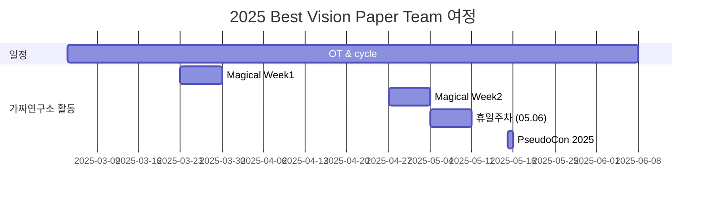

<h1 align="center"> Best Vision Paper </h1>

 

<!-- sheilds: https://shields.io/ -->
<!-- hits badge: https://hits.seeyoufarm.com/ -->

> Welcome to the Best Vision Paper Team Repository.
>
> We review and analyze the best papers from top-tier vision conferences including CVPR, ICCV, ECCV, and NeurIPS and more.
>
> Our team dives deep into these groundbreaking papers to understand their novel approaches and technical innovations.
> These award-winning papers represent the pinnacle of computer vision research, offering crucial insights into where the field is heading.
> Through careful analysis and discussion, we aim to understand not just the technical details, but also the key insights that drive the field forward.
> 
> What we do:
> - **Comprehensive Reviews** for in-depth best vision paper analysis
> - Weekly discussions to **share insights** and **explore potential research directions**
> - Technical deep-dives including code analysis and implementation details when available
>   
> Join us in advancing the field of computer vision through open collaboration and innovation!

 

> 저희 팀은 스터디를 통해 최고 수준의 비전 컨퍼런스에서 수상한 논문들을 심층 분석하고, 도출한 아이디어와 인사이트를 공유하는 것을 목표로 합니다.
> 
> 수상 경력에 빛나는 논문들은 컴퓨터 비전 연구의 정점을 나타내며, 비전 분야가 나아갈 방향에 대한 중요한 인사이트를 제공합니다.
> 
> 따라서 심층적 토론을 통해 비전 연구의 미래를 탐색 및 대응하고 연구 역량 강화를 통한 성장을 추구하는 분을 모시고자 합니다.
> 
> 논문은 2년 이내(2023~)의 최고 비전 컨퍼런스를 기준으로 자율적으로 선정 및 발표를 진행할 예정입니다.(나머지 Github 참조)

 

## 🌟 프로젝트 목표 (Project Vision)
_"다양한 비전(Vision) 논문을 심층 분석하고, 공유와 협업을 통해 새로운 통찰을 얻기"_  
- **최신 비전 연구 동향 탐색**을 통해 **빠르게 변화하는 비전 분야의 핵심 트렌드**에 대응
- **심층적 논문 분석** 및 **인사이트 도출**을 통한 연구 역량 강화
- **협업 기반의 지식 공유**를 통한 오픈소스 정신 지향
- **개인 역량 강화** 및 **네트워킹 확장**을 통한 미래 기회 모색하기

 

## 논문 선정 
- 2년 이내 Top-Tier Vision Conference에서 선정된 Best (Student) paper, Spotlight 혹은 이에 준하는 논문
  - 대상 학회: CVPR, ICCV, ICLR, ICML, ECCV, NeurIPS, AAAI 등 Top-tier Vision 학회
  - 참고 자료
      - [Best Papers Top Venues](https://github.com/SarahRastegar/Best-Papers-Top-Venues)
      - [CVPR 2024 Best Paper Award Winners](https://www.computer.org/press-room/cvpr-2024-announces-best-paper-award-winners)
    
- 시의성이 큰 Tech Report 
  - 예시: 2025 CES NVIDIA Cosmos, BigTech Tech Report

개인의 선호에 맞게 자율적으로 선택 및 발표 진행

 

## 발표자 진행 안내
- 논문 고지 : 발표일로부터 **최소 2주 전** 발표할 논문을 내부 **Discord에 사전 고지** & **Github 주차별 활동에 기입**
- 발표 자료 : 자율적으로 구성 및 작성
- 발표 후 : github에 자료 공유

 

## 🌱 참여 안내 (How to Engage)

**누구나 청강을 통해 모임을 참여하실 수 있습니다.**  
- 특별한 신청 없이 매주 화요일 오후 9:00~10:30에 맞추어 디스코드 #Room-AT 채널로 입장
- 1기 : 2025.03.04 ~ 2025.06.24

 

## 🧑 Contributor 

| 역할          | 이름 |  관심 분야                                                               | LinkedIn                         |
|---------------|------|-----------------------------------------------------------------------|----------------------------------------|
| **Project Manager** | 송건학 | Vision 기반 Generative AI (2D, 3D etc), Agent | [LinkedIN](https://www.linkedin.com/in/geonhak-song-09a037165/) |
| **Member** | 고재훈 |  |                |
| **Member** | 공성택 |  |                |
| **Member** | 김명섭 |  |                |
| **Member** | 김지연 |  |                |
| **Member** | 김지환 |  |                |
| **Member** | 채진영 |  |                |

 

## 🚀 Best Vision Paper Team 로드맵 (Roadmap)

 

## 💻 주차별 활동 (Activity History)

|회차| 날짜 | 논문 이름 | 학회 : 수상 이력 | Project/논문 링크 | 발표자 | 
| --------| -------- | -------- | -------- | -------- | ---- |
|1| 2025/03/04 | OT ||| 송건학 | 
|2| 2025/03/11 | Generative Image Dynamics | CVPR 2024 : Best Paper Award | [Project](https://generative-dynamics.github.io/) / [Arxiv](https://arxiv.org/abs/2309.07906) | 송건학 | 
|3| 2025/03/18 | Is ImageNet worth 1 video? Learning strong image encoders from 1 long unlabelled video | ICLR 2024, Honorable Mention |[Project](https://shashankvkt.github.io/dora) / [Arxiv](https://arxiv.org/abs/2309.07906) | 고재훈 | 
|4| 2025/03/25 | Magical Week ||| | 
|5| 2025/04/01 | TBD ||| 공성택 | 
|6| 2025/04/08 | TBD ||| TBD (1명) | 
|7| 2025/04/15 | TBD ||| TBD (1명) | 
|8| 2025/04/22 | TBD ||| TBD (1명) | 
|9| 2025/04/29 | Magical Week |||  | 
|10| 2025/05/06 | 대체 휴일 ||| | 
|11| 2025/05/13 | TBD ||| TBD (1명) | 
|12| 2025/05/20 | TBD ||| TBD (1명) | 
|13| 2025/05/27 | TBD ||| TBD (1명) | 
|14| 2025/06/03 | TBD ||| TBD (1명) | 
|15| 2025/06/10 | TBD ||| TBD (1명) | 
|16| 2025/06/17 | TBD ||| TBD (1명) | 
|17| 2025/06/24 | TBD ||| TBD (1명) | 

 

## Acknowledgement 🙏

Best Vision Paper Team is developed as part of Pseudo-Lab's Open Research Initiative. Special thanks to our contributors and the open source community for their valuable insights and contributions.

## About Pseudo Lab 👋🏼</h2>

[Pseudo-Lab](https://pseudo-lab.com/) is a non-profit organization focused on advancing machine learning and AI technologies. Our core values of Sharing, Motivation, and Collaborative Joy drive us to create impactful open-source projects. With over 5k+ researchers, we are committed to advancing machine learning and AI technologies.

<h2>Contributors 😃</h2>

  

<h2>License 🗞</h2>

This project is licensed under the [MIT License](https://opensource.org/licenses/MIT).
