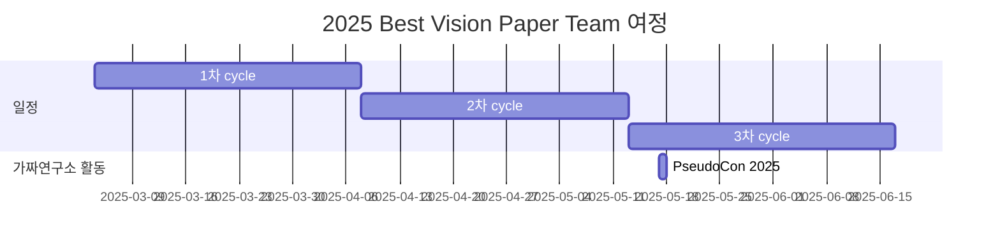

# Best Vision Paper 

<h1 align="center"> Best Vision Paper </h1>

 

<!-- sheilds: https://shields.io/ -->
<!-- hits badge: https://hits.seeyoufarm.com/ -->

> This is the repository of Best Vision Paper team.
>
> We thoroughly review and analyze the best papers from top-tier vision conferences such as CVPR, ICCV, ECCV, and NeurIPS.
>
> Our goal is to understand cutting-edge vision research and foster deeper insights into the evolving field of computer vision.
> We are not restricted to a single domain or approach. Rather, we focus on high-impact publications and innovative methodologies.
> 
> Through this initiative, we offer:
> - Comprehensive Reviews for in-depth best vision paper analysis
> - Collaborative discussions to foster innovative ideas and fresh perspectives
>   
> Join us in advancing the field of computer vision through open collaboration and innovation!

 

## 🌟 프로젝트 목표 (Project Vision)
_"다양한 비전(Vision) 논문을 심층 분석하고, 공유와 협업을 통해 새로운 통찰을 얻기"_  
- **최신 비전 연구 동향 탐색**을 통해 **빠르게 변화하는 비전 분야의 핵심 트렌드**에 대응
- **심층적 논문 분석** 및 **인사이트 도출**을 통한 연구 역량 강화
- **협업 기반의 지식 공유**를 통한 오픈소스 정신 지향
- **개인 역량 강화** 및 **네트워킹 확장**을 통한 미래 기회 모색하기

 

## 🌱 참여 안내 (How to Engage)
**누구나 청강을 통해 모임을 참여하실 수 있습니다.**  
- 특별한 신청 없이 매주 화요일 오후 9:00~10:30에 맞추어 디스코드 #Room-GH 채널로 입장

 

## 🧑 Contributor 

| 역할          | 이름 |  관심 분야                                                               | LinkedIn                         |
|---------------|------|-----------------------------------------------------------------------|----------------------------------------|
| **Project Manager** | 송건학 | Vision 기반 Generative AI (2D, 3D etc), Agent | [LinkedIN](https://www.linkedin.com/in/geonhak-song-09a037165/) |
| **Member** | - |  |                |
| **Member** | - |  |                |
| **Member** | - |  |                |
| **Member** | - |  |                |
| **Member** | - |  |                |
| **Member** | - |  |                |
| **Member** | - |  |                |
| **Member** | - |  |                |
| **Member** | - |  |                |

 

## 🚀 Best Vision Paper Team 로드맵 (Roadmap)

 

## 💻 주차별 활동 (Activity History)

|회차| 날짜 | 내용 | 발표자 | 
| --------| -------- | -------- | ---- |
|1| 2025/02/25 | OT | 송건학 |
|2| 2025/03/04 |  | 송건학 | 
|3| 2025/03/11 |  |  | 
|4| 2025/03/18 |  |  | 
|5| 2025/03/25 |  |  | 
|6| 2025/04/01 |  |  | 
|7| 2025/04/08 |  |  | 
|8| 2025/04/15 |  |  | 
|9| 2025/04/22 |  |  | 
|10| 2025/04/29 |   |  | 
|11| 2025/05/06 | 대체 휴일 | - | 
|12| 2025/05/13 |  |  | 
|13| 2025/05/20 |  |  | 
|14| 2025/05/27 |  |  | 
|15| 2025/06/03 |  |  | 
|16| 2025/06/10 |  |  | 

 

## Acknowledgement 🙏

Best Vision Paper Team is developed as part of Pseudo-Lab's Open Research Initiative. Special thanks to our contributors and the open source community for their valuable insights and contributions.

## About Pseudo Lab 👋🏼</h2>

[Pseudo-Lab](https://pseudo-lab.com/) is a non-profit organization focused on advancing machine learning and AI technologies. Our core values of Sharing, Motivation, and Collaborative Joy drive us to create impactful open-source projects. With over 5k+ researchers, we are committed to advancing machine learning and AI technologies.

<h2>Contributors 😃</h2>

  

<h2>License 🗞</h2>

This project is licensed under the [MIT License](https://opensource.org/licenses/MIT).
